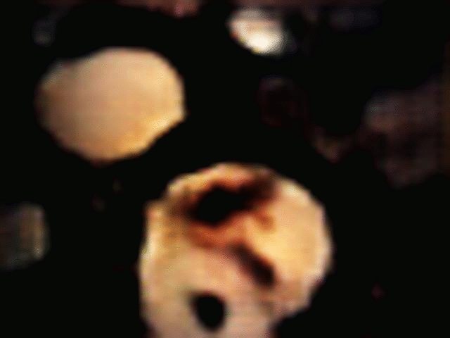
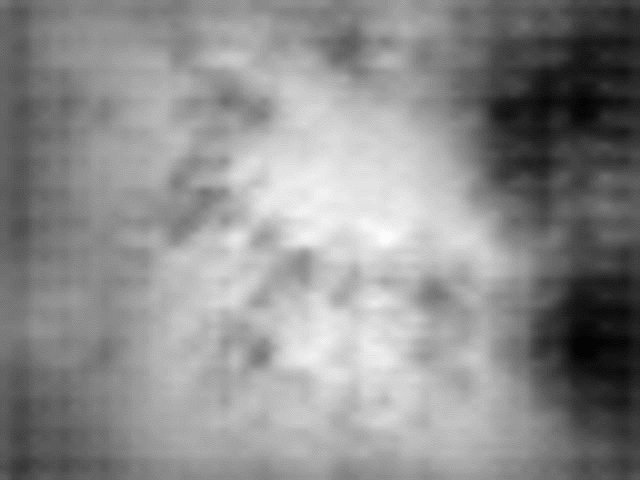

# Deep Future Gaze: Gaze Anticipation on Egocentric Videos Using Adversarial Networks

This repository contains an implementation of Deep Future Gaze: Gaze Anticipation on Egocentric Videos Using Adversarial Networks by Mengmi Zhang, Keng Teck Ma, Joo Hwee Lim, Qi Zhao, and Jiashi Feng, to appear at CVPR 2017. 

Please go to CVPR website for downloads. An unofficial copy is downloadable [Here](https://media.wix.com/ugd/d2b381_b48aa16a715b4826947d7d5ae383a8a6.pdf).

Supplementary Material is downloadable [Here](https://media.wix.com/ugd/d2b381_a8fc394461af405498126540d3012d3b.pdf).

## Project Description

We introduce a new problem of gaze anticipation on egocentric videos. This substantially extends the conventional gaze prediction problem to future frames by no longer confining it on the current frame. To solve this problem, we propose a new generative adversarial neural network based model, Deep Future Gaze (DFG). DFG generates multiple future frames conditioned on the single current frame and anticipates corresponding future gazes in next few seconds.

| [](vis/groundtruth.gif)  | [](vis/futuregaze.gif) | [](vis/generated.gif) |
|:---:|:---:|:---:|
| Ground Truth | Anticipated Gaze | Generated Future Frames |

| [](vis/foreground.gif)  | [](vis/background.gif) | [](vis/mask.gif) |
|:---:|:---:|:---:|
| Foreground | Background | Mask |


## Training

The code requires a Torch7 installation. It is developed based on [Generating Videos with Scene Dynamics](https://github.com/cvondrick/videogan).

Matio package is also required (save and load matlab arrays from Torch). Refer to [link](https://github.com/soumith/matio-ffi.torch) for installation.

It can be trained both on GPU and CPU. In order to train on GPU, 12GB or larger GPU memory is required. 

Clone the repository
```
git clone https://github.com/Mengmi/deepfuturegaze_gan.git
```
In /torchMM:

Run "main_GAN.lua" to start training GAN

Run "generateGAN.lua" to test the performance of GAN

Run "main_gazePred.lua" to start training gaze prediction module

Run "generateGaze.lua" to generate future gazes and save .mat in /results folder

## Data

We have trained and tested on three egocentric datasets. 

### GTEA and GTEA+ datasets:
They are available [Here](http://ai.stanford.edu/~alireza/GTEA_Gaze_Website/). 

### Our Object Search Dataset (OS):
we contribute this new dataset for the object search task. This dataset consists of 57 sequences on search and retrieval tasks performed by 55 subjects. Each video clip lasts for around 15 minutes with the frame rate 10 fps and frame resolution 480 by 640. Each subject is asked to search for a list of 22 items (including lanyard, laptop) and move them to the packing location (dining table). Details about the 22 items are provided in Supplementary Material. We select frames near the packing location and use videos 1 to 7 as test set and the rest for training and validation. The selected frame list is provided in 'OSdatasetProcess/OStable.mat'.

In /OSdatasetProcess:

Run "GenerateFrameOSDataset.m" to generate frames

Run "GenerateGazeOSDatast.m" to generate ground truth gaze recorded from eyetrackder

Run "GenerateAdversarialTrainingImage.m" to generate training images (consisting of concated 32 frames in one image)

Run "GenerateAdversarialTrainingMask.m" to generate gaussian masked fixation maps (consisting of concated 32 fixation maps in one image)

The dataset is avaialbe [Part1](https://drive.google.com/file/d/0B5nxfBgktACsMWdGOC1zQ29md0k/view?usp=sharing), [Part2](https://drive.google.com/file/d/0BzNj4DVGxJtiRmxJckUyVHg1SGM/view?usp=sharing).

The eyetracking ground truth is in OSdatasetProcess/VXY folder.

## Notes

The source code is for illustration purpose only. You can download and run directly. Note that /dataset folder only contains a few training samples for the code to run.  

In order to train the network, you must download GTEA, GTEAPlus and our Object Search Dataset. Sample codes for pre-processing datasets are provided in /OSdatasetProcess folder.

## File Description

Refer to Readme.txt for the detailed description of each file.

## License

National University of Singapore, Singapore

Institute for Infocomm Research, A*STAR, Singapore
